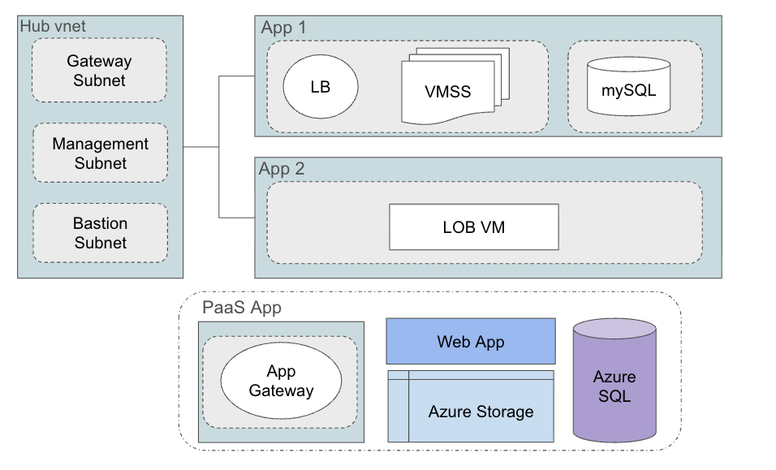

# Azure Hub-Spoke Architecture Deployment

Complete Bicep templates for deploying a production-ready hub-spoke network architecture with landing zone simulation.

## What Gets Deployed



### Hub VNet (Landing Zone)
- **Azure Bastion** - Secure RDP/SSH access (only internet entry point for VMs)
- **VPN Gateway** - On-premises connectivity (30-45 min deployment)
- **Network Security Groups** - Restricts all inbound traffic except to Bastion
- **Route Tables** - Private route table forces spoke traffic through VPN Gateway; public route table allows direct internet return paths for load-balanced subnets

### App 1 VNet (Multi-Tier Application)
#### Key Vault
- **`{prefix}-app1-kv`** - Stores the VM admin password as a secret named `AdminPassword`
  - Name derived as `{take(prefix, 15)}-app1-kv` to stay within the 24-character Key Vault name limit
  - RBAC-based access control
  - VMSS tagged with `arpio-config:admin-password-secret` pointing to the secret URL

#### Web Subnet
- **Public Load Balancer** - Distributes HTTP/HTTPS traffic
- **Linux VMSS** (Ubuntu 22.04) - Auto-scaling web tier with Python HTTP server (`python3 -m http.server 80`)
  - System Assigned Managed Identity (granted Key Vault Secrets User role)
  - Application Security Group
  - Port 80 exposed via load balancer; SSH blocked from internet (Bastion only)
  - Tagged with `arpio-config:admin-password-secret` → Key Vault secret URL

#### Database Subnet
- **Linux VM** (Ubuntu 22.04) - Database tier with MySQL
  - Only accessible from Web Subnet and Bastion
  - All outbound traffic routes through Hub VNet

### App 2 VNet (Windows Application)
- **Windows Server 2022 VM** - Application server
  - User Assigned Managed Identity
  - Application Security Group
  - All traffic routes through Hub VNet; RDP only via Bastion

### Optional PaaS Application
The `paas-application.bicep` module deploys a standalone PaaS stack. It is **not connected** to the hub-spoke VNets.

- Application Gateway (public entry point)
- App Service (Linux, .NET 8.0) — IP restricted to App Gateway only
- Azure SQL Database (public endpoint)
- Key Vault (RBAC with managed identity)
- Storage Account (2 containers + 1 queue)
- Container Instance (public IP)

## Prerequisites

- Azure CLI installed
- Azure subscription with Contributor access
- Bash shell (Linux/macOS/WSL)

## Quick Start

```bash
chmod +x deploy.sh
./deploy.sh
```

The script prompts for:
1. Subscription ID
2. Resource prefix (e.g., `arpio-demo`)
3. Azure region — works in all regions, including those without availability zones
4. Admin username/password — used for all VMs and SQL Database
5. VNet address spaces (defaults: `10.0.0.0/16`, `10.1.0.0/16`, `10.2.0.0/16`)
6. VM size for Linux/ARM VMs (default: `Standard_B2PS_v2`)
7. VM size for Windows VMs (default: `Standard_D2ads_v7`)
8. VMSS instance count (default: `2`)
9. Deploy PaaS application? (yes/no)
10. PaaS Key Vault secret (if deploying PaaS)

**Deployment time: 45-60 minutes** (VPN Gateway is the bottleneck)

## Manual Deployment

```bash
az login
az account set --subscription <subscription-id>

az deployment sub create \
  --name hub-spoke-deployment \
  --location eastus \
  --template-file main.bicep \
  --parameters \
    resourcePrefix="mycompany" \
    location='eastus' \
    adminUsername='azureuser' \
    adminPassword='YourSecurePassword123!' \
    hubVnetAddressPrefix='10.0.0.0/16' \
    app1VnetAddressPrefix='10.1.0.0/16' \
    app2VnetAddressPrefix='10.2.0.0/16'
```

### Deploy with Optional PaaS Application

```bash
az deployment sub create \
  --name hub-spoke-with-paas \
  --location eastus \
  --template-file main.bicep \
  --parameters \
    resourcePrefix='mycompany' \
    location='eastus' \
    adminUsername='azureuser' \
    adminPassword='YourSecurePassword123!' \
    deployPaasApplication=true \
    paasSecretValue='MyPaasSecret123!'
```

The PaaS application is **standalone** and **not connected** to the hub-spoke VNets. SQL Database uses the same admin credentials as the VMs.

## Project Structure

```
.
├── main.bicep                      # Orchestrator template (subscription scope)
├── deploy.sh                       # Interactive deployment script
├── modules/
│   ├── hub-vnet.bicep             # Hub VNet with Bastion & VPN Gateway
│   ├── app1-vnet.bicep            # App 1 VNet with LB, VMSS, DB VM
│   ├── app2-vnet.bicep            # App 2 VNet with Windows VM
│   ├── vnet-peering.bicep         # VNet peering module
│   └── paas-application.bicep     # Optional standalone PaaS stack
└── README.md
```

## Parameters

### Required
| Parameter | Description | Example |
|-----------|-------------|---------|
| `resourcePrefix` | Prefix for all resources | `arpio-hub` |
| `location` | Azure region | `eastus` |
| `adminUsername` | VM admin username | `azureuser` |
| `adminPassword` | VM admin password (12+ chars) | — |

### Optional
| Parameter | Description | Default |
|-----------|-------------|---------|
| `hubVnetAddressPrefix` | Hub VNet CIDR | `10.0.0.0/16` |
| `app1VnetAddressPrefix` | App 1 VNet CIDR | `10.1.0.0/16` |
| `app2VnetAddressPrefix` | App 2 VNet CIDR | `10.2.0.0/16` |
| `vmSizeLinux` | VM size for Linux/ARM VMs | `Standard_B2PS_v2` |
| `vmSizeWindows` | VM size for Windows VM | `Standard_D2ads_v7` |
| `vmssInstanceCount` | VMSS instance count | `2` |
| `deployPaasApplication` | Deploy optional PaaS stack | `false` |
| `paasSecretValue` | Secret for PaaS Key Vault | — |

## Accessing Your Deployment

### Via Azure Bastion (Recommended)
1. Go to Azure Portal → `{prefix}-hub-rg`
2. Find the Bastion resource
3. Use Bastion to connect to any VM in the spoke VNets

### Via VPN Gateway
1. Wait for VPN Gateway to finish deploying (30-45 min)
2. Configure Point-to-Site VPN in Azure Portal
3. Download VPN client and connect — access VMs via private IP

### App 1 Load Balancer
```bash
http://<load-balancer-public-ip>
```

### PaaS Application (if deployed)
```bash
http://<app-gateway-ip>       # App Service via App Gateway
http://<app-gateway-ip>:8080  # Container Instance via App Gateway
```

## Network Flow

### Inbound Traffic
```
Internet → Bastion Only
Internet → App 1 Load Balancer (ports 80/443) → VMSS
All other inbound traffic → BLOCKED
```

### Outbound Traffic
```
App 1 WebSubnet → Internet (direct, for LB health probes and return traffic)
App 1 DatabaseSubnet → Hub VNet → VPN Gateway → Internet/On-Premises
App 2 → Hub VNet → VPN Gateway → Internet/On-Premises
```

### Inter-VNet Communication
```
App 1 ↔ Hub (via peering)
App 2 ↔ Hub (via peering)
App 1 ↔ App 2 (via Hub — no direct peering)
```

## Security

### Network
- NSGs on all subnets with deny-by-default
- SSH/RDP blocked from internet — Bastion only
- Database VM isolated to web subnet + Bastion only
- Application Security Groups for fine-grained control
- Route tables force private subnet traffic through Hub VPN Gateway; WebSubnet uses an unrestricted route table for LB compatibility

### Identity & Access
- System Assigned Identity for VMSS — granted Key Vault Secrets User role on the App 1 Key Vault
- User Assigned Identity for App 2 VM
- No public IPs on VMs (except via load balancer)
- Key Vault stores admin password; VMSS tagged with `arpio-config:admin-password-secret` for Arpio secret discovery

### PaaS (if deployed)
- App Service IP restricted — only accessible via Application Gateway
- Key Vault uses RBAC with App Service managed identity
- SQL Database uses public endpoint with Azure Services firewall rule
- Container Instance has public IP (ACI does not support IP restrictions)

## Cost Estimates

### Hub-Spoke Only (~$460/month, US East)
| Resource | Cost |
|----------|------|
| VPN Gateway (VpnGw1) | ~$140 |
| Azure Bastion (Standard) | ~$140 |
| VMs (VMSS + 2 VMs) | ~$150 |
| Load Balancer (Standard) | ~$20 |
| Public IPs & Networking | ~$10 |

### PaaS Stack Add-On (~+$350/month)
| Resource | Cost |
|----------|------|
| Application Gateway (Standard_v2) | ~$150 |
| App Service (P1v3) | ~$120 |
| Container Instance | ~$30 |
| Networking | ~$40 |
| SQL Database (Basic) + Storage + Key Vault | ~$10 |

**Total with both: ~$810/month**

## Customization

### Change VMSS Instance Count
```bash
az vmss scale \
  --resource-group <prefix>-app1-rg \
  --name <prefix>-app1-vmss \
  --new-capacity 5
```

### Modify VM Sizes
```bash
--parameters vmSizeLinux="Standard_D2s_v3" vmSizeWindows="Standard_D4s_v3"
```

### Add More Spoke VNets
1. Copy `modules/app1-vnet.bicep` or `modules/app2-vnet.bicep`
2. Modify for your needs
3. Add module reference and peering in `main.bicep`

## Troubleshooting

### VPN Gateway Deployment Timeout
VPN Gateway takes 30-45 minutes — this is normal. Check status:
```bash
az deployment sub show --name <deployment-name>
az network vnet-gateway show \
  --resource-group <prefix>-hub-rg \
  --name <prefix>-vpn-gateway
```

### Cannot Connect to VMs
Use Bastion or VPN Gateway. Direct internet access is blocked by design.

### Load Balancer Not Working
```bash
az network lb show \
  --resource-group <prefix>-app1-rg \
  --name <prefix>-app1-lb \
  --query backendAddressPools

az vmss list-instances \
  --resource-group <prefix>-app1-rg \
  --name <prefix>-app1-vmss
```

## Cleanup

```bash
PREFIX="your-prefix"
az group delete --name ${PREFIX}-hub-rg  --yes --no-wait
az group delete --name ${PREFIX}-app1-rg --yes --no-wait
az group delete --name ${PREFIX}-app2-rg --yes --no-wait
az group delete --name ${PREFIX}-paas-rg --yes --no-wait  # if PaaS was deployed
```
