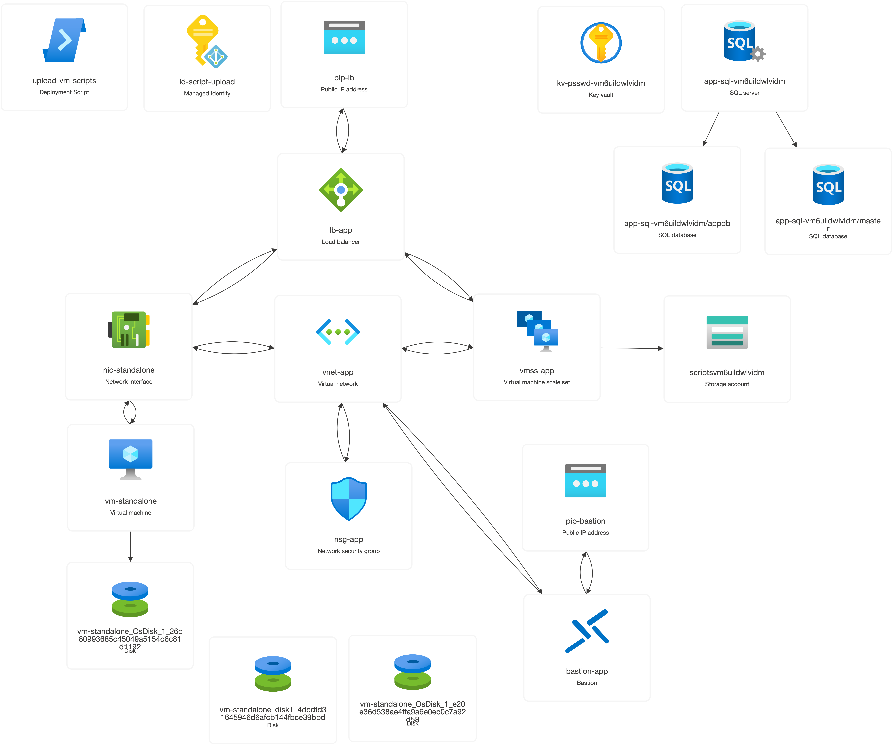
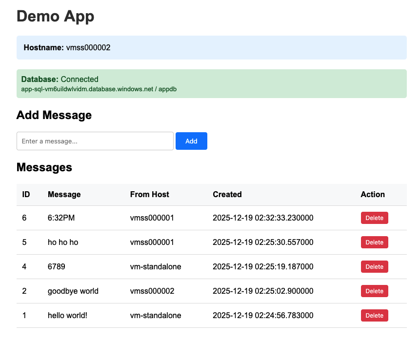

# Load Balancer - Server - Database stack

This folder contains Infrastructure as Code (IaC) configuration to deploy a **Load Balancer - Server - Database** stack.

**Bicep templates are being kept up to date.** ARM templates are here for historical purposes only

The deployed workload looks like this:


The workload includes the following resources:
* Single standalone VM and multiple VMSS-based VMs
* Azure SQL Database 
* Load Balancer targeting both standalone and VMSS VMs
* All servers are running a simple Flask app that reads and writes to the DB
* Bastions are deployed to access the VMs
* Azure Storage Account containing code and scripts in Blob Storage for use by the VMs
* NAT Gateway

The Bicep template does all necessary initialization, including uploading the scripts and configuring VM user data to use them.



## Deployment

Inspect the [`azuredeploy.bicepparam`](./azuredeploy.bicepparam) parameters file and make any changes. Specifically you may want to change 
* `location`: The region the workload is deployed to
* `vmSku`: Choose a VM SKU available in your chosen region
* `sshPublicKey`: If you want to be able to use the Bastion to ssh to the VMs, replace this with a public key for which you have access to the private key

Ensure you are in the correct subscription
```bash
az account set --subscription <subscription_id>
```

If this is a new deployment and you are using a new resource group, then create it
```bash
az group create -n <resource_group_name> -l <region>
```

```bash
az deployment group create \
  --name lb-server-db-bicep \
  --resource-group <resource_group_name> \
  --template-file azuredeploy.bicep \
  --parameters azuredeploy.bicepparam
```

