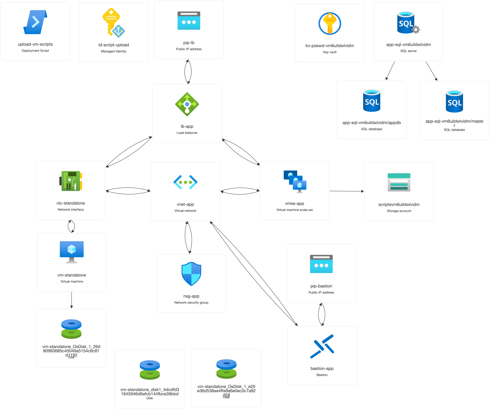
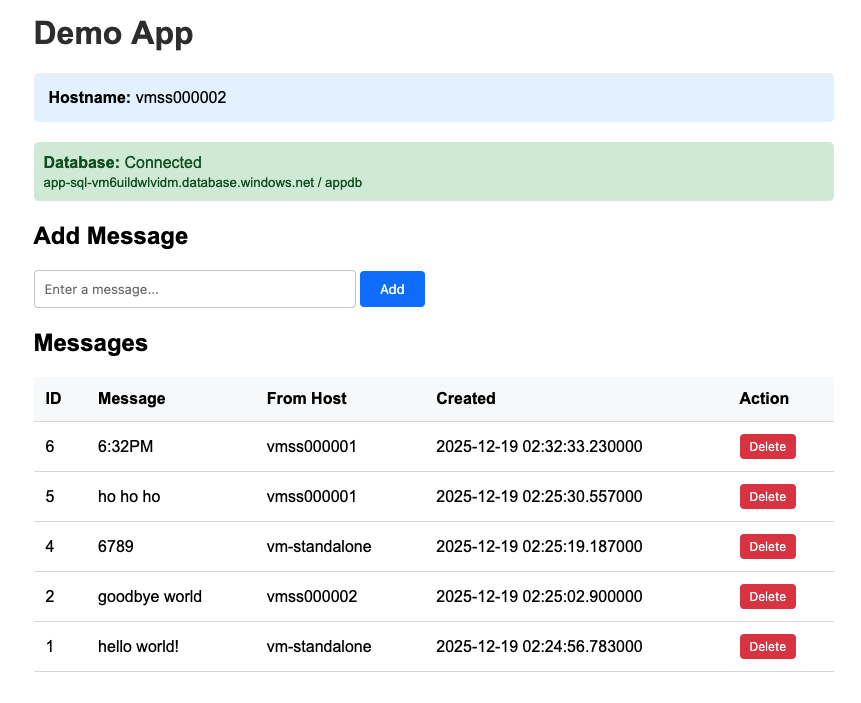

# Load Balancer - Server - Database stack

This folder contains Infrastructure as Code (IaC) configuration to deploy a **Load Balancer - Server - Database** stack.

**Bicep templates are being kept up to date.** ARM templates are here for historical purposes only

The deployed workload looks like this:


The workload includes the following resources:
* Single standalone VM and multiple VMSS-based VMs
* Azure SQL Database 
* Load Balancer targeting both standalone and VMSS VMs
* All servers are running a simple Flask app that reads and writes to the DB
* Bastions are deployed to access the VMs
* Azure Storage Account containing code and scripts in Blob Storage for use by the VMs
* NAT Gateway

The Bicep template does all necessary initialization, including uploading the scripts and configuring VM user data to use them.



## Deployment

Inspect the [`azuredeploy.bicepparam`](./azuredeploy.bicepparam) parameters file and make any changes. Specifically you may want to change 
* `location`: The region the workload is deployed to
* `vmSku`: Choose a VM SKU available in your chosen region
* `sshPublicKey`: If you want to be able to use the Bastion to ssh to the VMs, replace this with a public key for which you have access to the private key

Ensure you are in the correct subscription
```bash
az account set --subscription <subscription_id>
```

If this is a new deployment and you are using a new resource group, then create it
```bash
az group create -n <resource_group_name> -l <region>
```

```bash
az deployment group create \
  --name lb-server-db-bicep \
  --resource-group <resource_group_name> \
  --template-file azuredeploy.bicep \
  --parameters azuredeploy.bicepparam
```

## VM bootstrapping and disaster recovery

### How VMs are configured at boot

The Bicep template creates a Storage Account containing three files uploaded as blobs:

* **`vm-setup.sh`** — Bootstrap script that installs dependencies (Python, ODBC drivers), downloads `app.py` from blob storage, and creates a systemd service to run the Flask app.
* **`app.py`** — The Flask application that reads/writes to Azure SQL.
* **`sample-data.csv`** — Sample data loaded into the database by the app.

Each VM and VMSS uses two mechanisms to reference this storage:

1. **`userData`** — A base64-encoded JSON blob attached to the VM/VMSS resource containing the storage account URL, storage account name, SQL connection details, and credentials. At runtime, a startup wrapper script created inline by `vm-setup.sh` fetches this JSON from the [Azure Instance Metadata Service (IMDS)](https://learn.microsoft.com/en-us/azure/virtual-machines/instance-metadata-service) and exports the values as environment variables before launching the app.

2. **CustomScript extension** — An Azure VM extension (`Microsoft.Azure.Extensions/CustomScript`) that runs during provisioning. It downloads `vm-setup.sh` from blob storage and executes it. The script then downloads `app.py` from the same storage account. The app runs using the correct configuration from the `userData`.

### How Arpio handles disaster recovery

During recovery, Arpio translates `userData` on the recovered VMSS instances, rewriting references to point to the recovered storage account and SQL server in the target region. This means the running application (via environment vars set from `userData` in IMDS) will automatically connect to the correct recovered resources.

* For VMSS, CustomScript will run as each VM is provisioned, which pulls in the latest `userData` from IMDS as described above.
* For standalone (static) VMs, `vm-setup.sh` has already setup `systemd` to run `start.sh` on every boot, and `start.sh` fetches `userData` from IMDS fresh each time.
